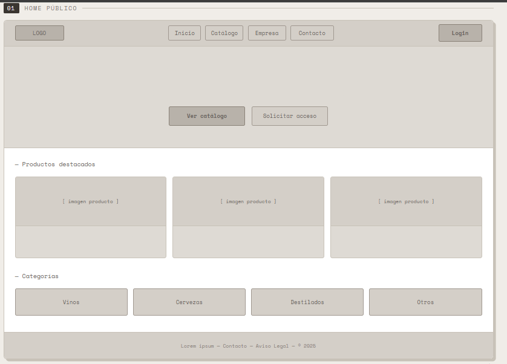
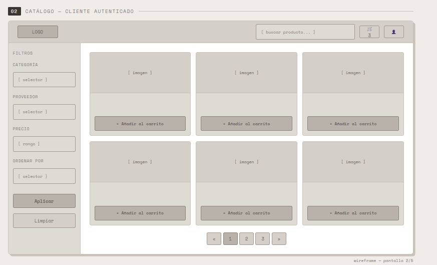
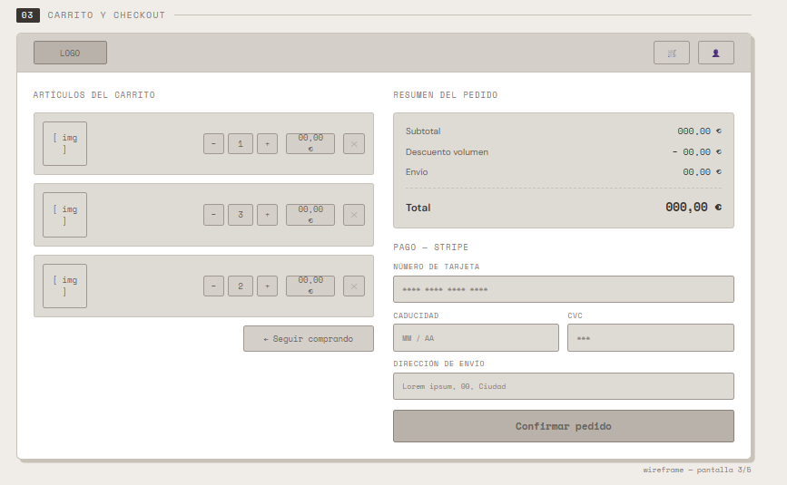
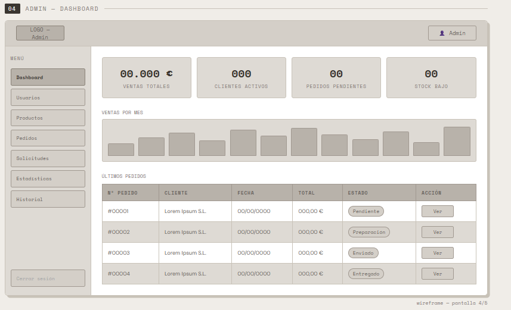
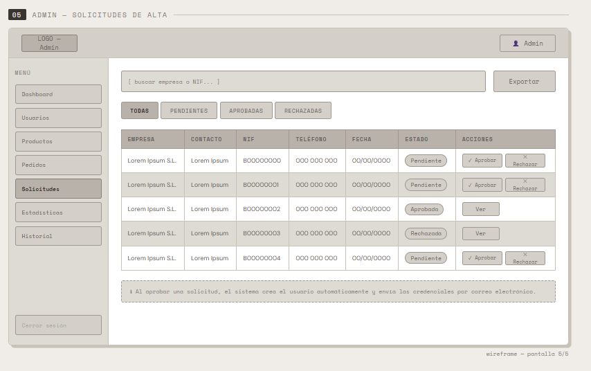

# Anteproyecto — Aplicación Web para Distribuidora de Bebidas Alcohólicas

## Idea del Proyecto

El proyecto consiste en una aplicación web orientada al sector B2B (Business to Business) para una empresa distribuidora de bebidas alcohólicas. La empresa trabaja exclusivamente con el canal **HORECA** (Hoteles, Restaurantes y Cafeterías), por lo que el acceso a la plataforma de compra está restringido a clientes previamente verificados y aprobados.

La aplicación contará con dos grandes áreas: una parte pública orientada a la presentación de la empresa y su catálogo, y una parte privada que diferenciará entre el rol de **cliente** y el rol de **administrador**.

---

## Funcionalidades

### Zona Pública (usuario anónimo)

- Página de inicio con presentación de la empresa, catálogo de productos y categorías.
- Visualización del catálogo de productos con filtros y búsqueda (sin posibilidad de comprar).
- Formulario de **solicitud de alta como cliente**: el usuario rellena sus datos (nombre, empresa, NIF, teléfono, dirección, etc.) y envía la solicitud. Esta llega al administrador para su revisión.
- Login para clientes ya aprobados. **No existe un registro público**; el acceso solo se otorga tras aprobación administrativa.

---

### Zona Cliente (usuario autenticado)

- Catálogo completo con búsqueda, filtrado por categorías, proveedor, precio, etc.
- **Carrito de la compra** y proceso de checkout con pasarela de pago integrada mediante **Stripe**.
- **Historial de pedidos** con estados (pendiente, en preparación, enviado, entregado) y posibilidad de repetir un pedido anterior con un clic.
- Sistema de **favoritos** para guardar productos de interés.
- Algoritmo de **productos recomendados** basado en el historial de compras del propio usuario (los artículos que más pide aparecen destacados automáticamente).
- **Precios personalizados por cliente**: cada cliente puede tener tarifas negociadas distintas, reflejando la realidad del canal HORECA.
- Gestión del perfil: actualización de datos personales, dirección de envío y contraseña.

---

### Zona Administrador

- **Gestión de solicitudes de alta**: el administrador revisa las solicitudes de nuevos clientes, las aprueba o rechaza. Si se aprueba, el sistema crea automáticamente el usuario y le envía las credenciales de acceso por correo electrónico.
- **CRUD de usuarios**: crear, editar, activar/desactivar y eliminar clientes.
- **CRUD de productos**: crear, editar y eliminar artículos del catálogo, con gestión de imágenes, categorías, proveedores y stock.
- **Control de stock**: seguimiento del inventario con alertas cuando un producto baja de un umbral definido.
- **Gestión de pedidos**: visualización de todos los pedidos con posibilidad de cambiar su estado y notificar al cliente por email en cada cambio.
- **Descuentos por volumen**: configuración de reglas de descuento automático según la cantidad comprada (ej. "a partir de 10 cajas de vino, 5% de descuento").
- **Precios personalizados**: asignación de tarifas específicas por cliente o grupo de clientes.
- **Panel de estadísticas**: productos más vendidos, clientes con mayor volumen de compra, ingresos por período, pedidos por estado, etc.
- **Historial de acciones**: registro de las acciones realizadas en el panel de administración (quién hizo qué y cuándo).

---

## Tecnologías Utilizadas

| Capa                     | Tecnología              |
| ------------------------ | ----------------------- |
| **Frontend**             | Angular                 |
| **Backend**              | Laravel (PHP)           |
| **Base de datos**        | MySQL                   |
| **Pasarela de pago**     | Stripe                  |
| **Correo electrónico**   | Laravel Mail (SMTP)     |
| **Contenedores**         | Docker + Docker Compose |
| **Control de versiones** | Git + GitHub            |

---

## Roles de Usuario

| Rol               | Descripción                                                  |
| ----------------- | ------------------------------------------------------------ |
| **Anónimo**       | Puede ver la web pública y enviar solicitud de alta          |
| **Cliente**       | Puede comprar, gestionar su carrito, ver pedidos y favoritos |
| **Administrador** | Control total: usuarios, productos, pedidos, estadísticas    |

---

## Prototipos de Baja Fidelidad

---

### 1. Página de Inicio (Home público)

---

### 2. Catálogo (cliente autenticado)

---

### 3. Carrito y Checkout

---

### 4. Panel de Administración — Dashboard

---

### 5. Panel de Administración — Gestión de Solicitudes

---
